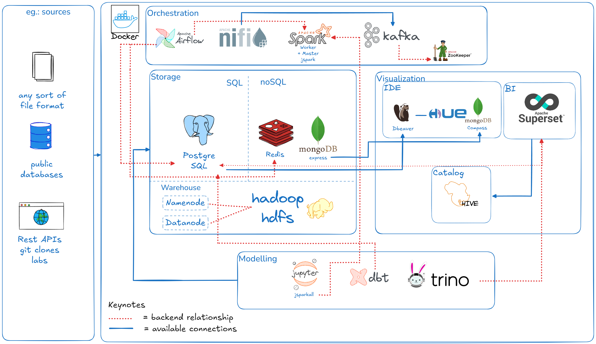

#  Modern Data Stack Delta-Spark-Hive

**Esse projeto mira criar uma plataforma em bigdata para estudos, são criados diversos serviços no docker como um ambiente provisionado e são estruturadas conexões entre os ambientes.**

o projeto foi inspirado na ideia de ter um ambiente de laboratório com spark 4 e airflow 3. 

Principais serviços do ambiente:

| Componente | Versão   |
|------------|----------|
| Spark      | 4.0.0    |
| Scala      | 2.13     |
| Delta      | 4.0.1    |
| Airflow    | 3.0      |
| Hive       | 4.0.1    |


## Arquitetura do Projeto




---

---
# Como iniciar o projeto?

> ⚠️ **Atenção:** o projeto foi configurado para uso do python 3.10.x para compatibilidade entre o airflow worker e o spark, que serve para jupyter e spark master no mesmo contâiner, recomenda-se não fazer **downgrade** de versões do python, perceba que, ao mudar a versão do python no spark, devemos mudar o python no airflow e vice-versa.
>> o *compose* foi configurado para persistir dados localmente, para não ocorrer deletes de volumes acidentais em outros envs que o usuário pode configurar. sinta-se a vontade para alterar isso no docker compose se preferir. 

## Iniciando de fato o projeto

1. inicie o projeto 

    git clone https://github.com/ibmendes/mds-spark4

> na primeira execução, executar no terminal 'docker compose build' em seguida, podemos subir o projeto pelo bash

    ```bash
    chmod +x start.sh
    ./start.sh
    ou 
    sh start.sh
    ```

2. lidando com o docker

    para derrubar o projeto, utilize:

        CTRL+C no terminal bash aberto / docker compose down

    para apagar os dados do projeto utilize

        docker compose down -v

    iniciando serviços indivdualmente

        docker compose up <serviço>

        ou pelo docker compose no vscode, clicando em run service:

---
## 📦 Serviços e Portas

| Serviço                | Porta                | Descrição                                   | Link de Acesso                                      |
|------------------------|----------------------|---------------------------------------------|-----------------------------------------------------|
| PostgreSQL             | `5432`               | Backend Airflow, Hive Metastore etc         | N/A (acesso via cliente SQL, ex: DBeaver)           |
| HiveServer2            | `10000`              | JDBC/Beeline                                | beeline -u jdbc:hive2://localhost:10000 ou beeline  |
| Metastore              | `9863` / `10002`     | API Thrift para Metastore                   | N/A (acesso via Spark/Hive)                         |
| NameNode               | `9870`               | Interface Web do HDFS NameNode              | [http://localhost:9870](http://localhost:9870)      |
| RPC HDFS NameNode      | `9000`               | Comunicação entre serviços HDFS             | hdfs://namenode:9000/                               |
| DataNode               | `9864`               | Interface Web do HDFS DataNode              | [http://localhost:9864](http://localhost:9864)      |
| Airflow 3.0 api-server | `8080`               | Interface Web do Airflow                    | [http://localhost:8080](http://localhost:8080)      |
| Flower                 | `5555` / `5558`      | Dependência do Airflow, Celery Worker       | n/a                                                 |
| Redis                  | `6379`               | Dependência do Airflow, backend             | N/A                                                 |
| Spark UI               |`7078`/`4040`(session)| Interface Web do Spark (ativa na sessão)    | [http://localhost:7078](http://localhost:7078)      |
| trino                  | `9090`               | ui presto/trino para o superset/modelagem   | [http://localhost:9090](http://localhost:9090)      |
| mongo-express          | `9092`               |  nosql                                      | [http://localhost:9092](http://localhost:9092)      |
| nifi                   | `8443`               |                                             | [https://localhost:8443/nifi](https://localhost:8443/nifi)|


📈 **Data Viz**

| Serviço   | Porta   | Descrição                                 | Link de Acesso                                 |
|-----------|---------|-------------------------------------------|------------------------------------------------|
| Hue       | `8889`  | Consultas SQL a databases                 | [http://localhost:8889](http://localhost:8889) |
| superset  | `9091`  | Consultas SQL a databases e dashboards                 | [http://localhost:9091](http://localhost:9091) |
---

📦 Credenciais de acesso entre os serviços

| Serviço        | Host       | Porta  | Banco de Dados      | Usuário           | Senha        |
|----------------|------------|--------|---------------------|-------------------|--------------|
| PostgreSQL     | localhost  | 5432   | metastore           | hiveuser          | hivepassword |
| Airflow        | localhost  | 8080   | airflow (Postgres)  | airflow           | airflow      |
| Spark          | localhost  | 8081   | —                   | sparkuser         | —            |
| Spark Master   | localhost  | 7077   | —                   | sparkuser         | —            |
| Hue            | localhost  | 8889   | —                   | admin             | admin        |
| Hive Metastore | localhost  | 10000  | default             | hdfs              | —            |
| trino          | localhost  | 9090   | -                   | admin             | —            |
| superset       | localhost  | 9091   | -                   | admin             |admin         |
| mongo-express  | localhost  | 8081   | -                   | root              |example       |
| nifi           | localhost  | 8443   | -                   | admin             |adminadmin123 |

🔍 Acesso via terminal ao **hive (estando no Contâiner do postgre)**:

```bash
psql -h localhost -U hiveuser -d metastore
```


# Entendendo a estrutura do projeto

    ├── arquitetura.png
    ├── dbt
    ├── docker-compose.yml
    ├── notebooks <--- qualquer notebook ou py aqui irá pro jspark
    ├── readme.md
    ├── src-docker  <- estrutura pertinente ao docker, "servico.Dockerfile" é incluso na raiz para facilitar o contexto nas subpastas
    │   ├── {servico}.Dockerfile
    │   ├── build
    │   │   ├── config <-- config hive
    │   │   ├── downloads <------------------------------imagens de insumo para criar o ambiente hive e hdfs
    │   │   ├── requirements.txt  <-- pypi
    │   │   ├── spark
    │   │   │   └── jars <--- jars extras para o classpath spark
    │   │   │       ├── ambiente <- jars de ambiente
    │   │   ├── superset
    │   │   └── trino
    │   │       └── etc
    │   │           ├── catalog
    │   │           │   └── hive.properties <-- acesso ao hive metastore
    │   ├── setup.sh <---------- download tarballs
    ├── stack <--------- onde vão as coisas em um ambiente produtivo
    │   ├── airflow
    │   │   ├── dags <--- espaços para versionar as dags do airflow
    │   │   └── utils
    │   │       ├── notebooks <---- para servir como utils de dags com papermill
    │   │       └── py  <---- para servir como utils de dags nativas em py
    │   ├── notebooks	<--- espaço para testes, servindo como uma outra alternativa da /notebooks da raiz do projeto. 
    │   │   ├── saslab.ipynb
    │   │   └── teste_ambiente.ipynb
    │   └── trino
    │       └── teste.sql <- querys de exemplo pra uso no container do trino
    └── start.sh <- init

## Documentações
Airflow:
- [Airflow Docker Compose Guide](https://airflow.apache.org/docs/apache-airflow/stable/howto/docker-compose/index.html)  
- [Building Airflow Docker Stack](https://airflow.apache.org/docs/docker-stack/build.html)


### Hive
- [Hive Quickstart Guide](https://hive.apache.org/developement/quickstart/)

### Postgres Documentation
- [Postgres Docker Hub](https://hub.docker.com/_/postgres)

### spark 4.0.0  + delta-spark
- [releases apache spark](https://spark.apache.org/releases/spark-release-4-0-0.html)
- [delta with spark 4](https://github.com/delta-io/delta/releases/tag/v4.0.0-final-rc1)

### trino
- [hdfs configuration](https://trino.io/docs/current/connector/hive.html#hive-file-system-configuration)

### dbt
- [docker-install dbt](https://docs.getdbt.com/docs/core/docker-install)

### mongodb express
- [Express & MongoDB](https://www.mongodb.com/resources/products/compatibilities/express)

### nifi
- [The core concepts of NiFi](https://nifi.apache.org/docs/nifi-docs/)


## Referências e Créditos
O Contexto hive + hdfs foi construido partindo do fork do reposótório abaixo:
- [spark_delta_hive_metastore](https://github.com/experientlabs/spark_delta_hive_metastore)

> ⚠️ **Disclaimers relevantes:** por se tratar de um ambiente de laboratório, são removidas autenticações do serviço e grande parte das políticas de segurança, a finalidade desse cluster é ser um ambiente de estudos e não produtivo.